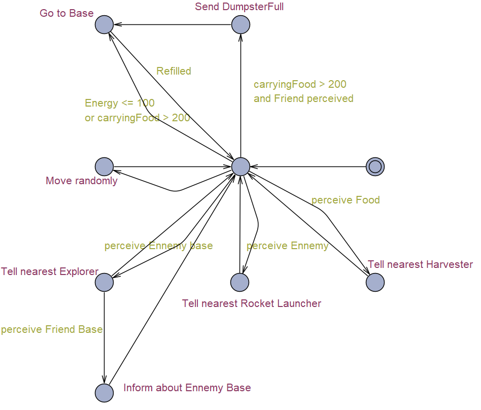
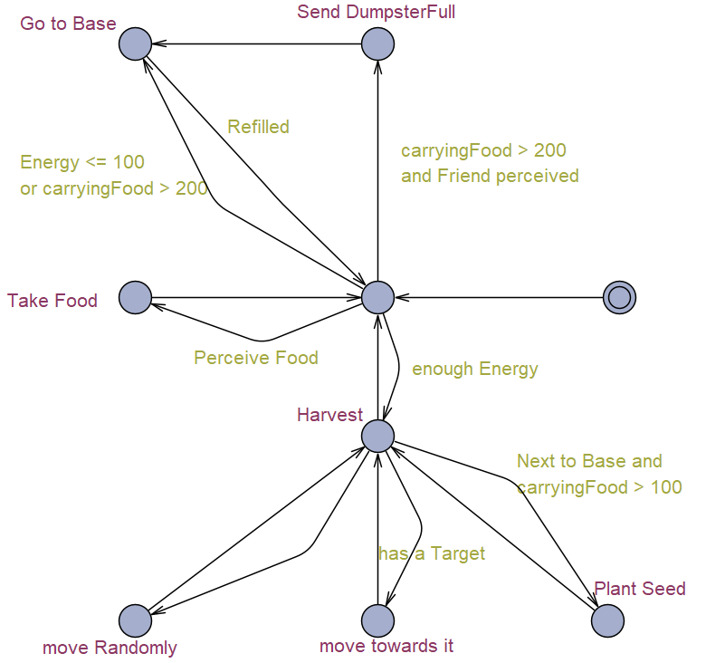
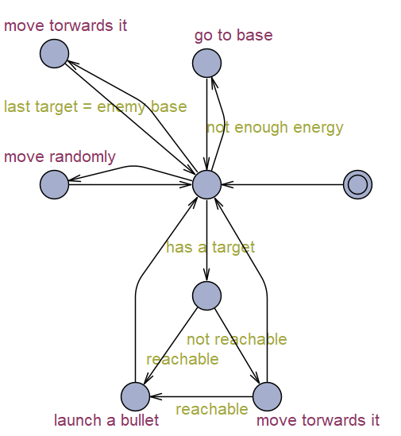
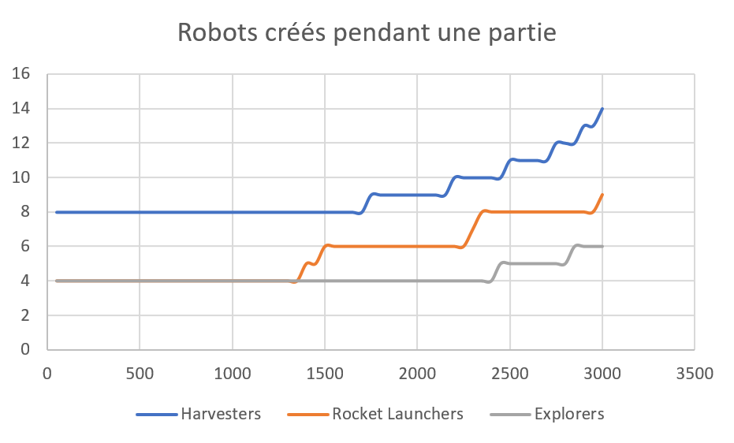

# Rapport Projet Warbot

## Hélène de Foras, M2 CNS SA

-----------------------------------

## Introduction

Dans le cadre du cours Intelligence Artificielle Distribuée Systèmes Multi-Agents, le projet Warbot présente une plateforme interactive où les joueurs doivent implanter une stratégie décentralisée. Inspiré par le jeu original proposé par J. Ferber, ce projet repose sur une simulation où deux équipes de robots, rouges et verts, s'affrontent dans un environnement commun. L'objectif principal est d'accumuler des ressources en développant les capacités des robots ou en neutralisant les forces adverses.

Dans ce projet, j'ai complété le code existant en modifiant les trois types d'agents réactifs : bases, explorateurs et harvesters. Je vais détailler le comportement de ces robots ci-dessous, et expliquer ma stratégie.

<div style="page-break-after: always;"></div>

## Bases

On commence la partie avec 4 Harvesters, 2 Explorer et 2 Rocket Launcher. Les Harvesters permettent de récupérer de la nourriture et de pouvoir créer plus vite d'autres robots. Les explorateurs indiquent aux Harvesters où est la nourriture, et où sont les ennemis. Et les RocketLaunchers ont pour objectif de tuer les robots ennemis, pour que l'adversaire ne se développe pas trop vite.

J'ai échangé les probas d'avoir un Harvester ou un Rocket Launcher dans la base dans le cas où energy > 12000. Ainsi la proba d'avoir un RocketLauncher est 50%, un Harvester est 25%, un Explorateur est 25%. Le but est de pouvoir achever l'adversaire plus vite, quand on a assez de nourriture pour le faire. 

A partir du moment où la base est informée de la position d'une base ennemie, ```brain[4].y``` est mis à 1. Lorsqu'il y a un RocketLauncher dans sa zone de perception, la base lui envoie l'information de la base ennemie avec ```INFORM_ABOUT_XYTARGET```. D'ailleurs, ce type de message est utilisé seulement pour informer sur les bases ennemies, pas les autres agents. 

Les robots amis peuvent envoyer des messages concernant la position des bases ennemies qui est alors enregistrée dans ```brain[0]```, puis transmise aux autres agents.

Voici un automate à états finis qui explique le fonctionnement d'une base :


Dans cet automate et les suivants, l'état qui a deux cercles est l'état initial.

<div style="page-break-after: always;"></div>

## Exploraters

Si la benne de l'explorateur est pleine, il informe le robot ami le plus proche avec ```DUMPSTER_FULL```, en retournant vers la base. C'est le niveau de priorité le plus fort.

L'explorateur qui trouve une base la met en mémoire dans ```brain[0]``` et dès qu'il retourne à l'une des bases amies, il lui transmet la position de la base ennemie. 

J'ai rajouté les deux messages suivants : 
```java
  final int DUMPSTER_FULL = 5;
  final int DUMPSTER_NOT_FULL = 6;
```
Le premier indique que la benne contenant la nourriture est pleine (```carryingFood > 200```), et le deuxième indique que la benne n'est pas pleine (```carryingFood < 150```). Lorsque ```carryingFood``` est entre 150 et 200, la benne est presque pleine donc on ne la charge pas plus.

Lorsque l'explorateur reçoit le message ```DUMPSTER_FULL```, il lui envoie ```DUMPSTER_NOT_FULL``` s'il a la place de récupérer de la nourriture. 

Si l'explorateur reçoit ```DUMPSTER_NOT_FULL``` et qu'il a trop de nourriture, il lui en envoie 50 avec la fonction ```giveFood```. 

En cas de déplacement aléatoire, j'ai réduit l'angle de rotation maximal à 30°.

Voici un automate à états finis présentant le comportement d'un Explorer :



<div style="page-break-after: always;"></div>

## Harvesters

A part pour la partie des bases ennemies, les modifications dans le code des Harvesters sont les mêmes que pour les Exploraters.

Voici un automate à états finis présentant le comportement d'un agent Harvester :



<div style="page-break-after: always;"></div>

## Rocket Launchers

C'est dans cette partie que j'ai fait le plus de modifications. 

Dans la fonction ```go```, on commence par traiter les messages reçus. 

Quand le RL rentre à la base, on met ```brain[4].y``` à 0, pour indiquer qu'il n'a plus de target. 

Sinon, s'il y a une cible dans la zone de perception, elle est enregistrée dans ```brain[0]```. Si elle est atteignable, on lance une balle. Si on a une cible et qu'elle est trop loin, on se dirige vers elle avec ```tryToMoveForward```. Et si en se rapprochant elle entre dans la zone de tir, on lance une balle vers elle. 

Si la dernière cible en mémoire est une base ennemie, on se dirige vers elle. Et s'il n'y a juste pas de cible, on fait un pas de marche aléatoire, avec un angle maximum de 30°. 

A la fin de la boucle ```go```, on remet ```brain[4].y``` à 0, pour indiquer qu'on a plus de cible. 

Pour suivre une cible, j'utilise les formules suivantes (qui donnent la position supposée de la cible). Cela correspond à la formule qu'utilise les Fafs pour suivre leur cible. 
```java
float posx = brain[0].x + speed*patchSize*cos(towards(brain[0]));
float posy = brain[0].y + speed*patchSize*sin(towards(brain[0]));
```


Dans la fonction ```handleMessages```, on parcourt les messages reçus. Ils peuvent être de type ```INFORM_ABOUT_TARGET``` ou ```INFORM_ABOUT_XYTARGET``` (qui ne peuvent concerner que les bases). On rajoute l'information de la position du robot ennemi s'il est plus proche dans ```brain[0]```. 

Voici un automate à états finis qui explique le fonctionnement d'un Rocket Launcher :



<div style="page-break-after: always;"></div>

## Analyse des paramètres du modèle

Les paramètres du modèle que je vais étudier sont le nombre de chaque type de robot à créer au début de la partie. C'est à dire ```brain[5].x```, ```brain[5].y``` et ```brain[5].z```. Pour évaluer les paramètres  d'entrée, on utilise le nombre de ticks en moyenne pour que l'adversaire n'ait plus d'énergie, ainsi que l'énergie de l'équipe rouge en moyenne à ce moment là.

| Harvesters | Rocket Launchers | Explorers | Ticks | Energie | 
| ----- | ----- | ----- | ----- | --- |
| 8 | 0 | 0 | 4800 | 127000 |
| 0 | 0 | 8 | 6100 | 72000 | 
| 4 | 4 | 0 | 3200 | 82000 |
| 4 | 0 | 4 | 4600 | 85000 |
| 0 | 4 | 4 | 3300 | 63000 |
| 4 | 2 | 2 | 3700 | 97000 |
| 2 | 4 | 2 | 2300 | 59000 |
| 2 | 2 | 4 | 3900 | 72000 |

On veut minimiser le nombre de ticks et maximiser l'énergie, voici le graphe de l'énergie en fonction des ticks à la fin de la partie.


Un point appartient à l'ensemble de Pareto si aucun autre point n'est à la fois plus à gauche (moins de ticks) et plus haut (plus d'énergie) sur le graphique. Donc l'ensemble de Pareto contient les quatres points en haut à gauche (surlignés en jaune). 

Finalement, j'ai choisi (3700, 97000), en vert sur le graphique, c'est à dire 4 Harvesters, 2 Rocket Launchers et 2 Exploraters comme paramètres du modèle.

<div style="page-break-after: always;"></div>

## Stratégie

Je vais maintenant expliquer la stratégie que j'ai essayé d'établir. 

Tout d'abord on commence avec deux fois plus d'Harvesters que d'autres robots, car le premier objectif est de récolter de la nourriture pour avoir de l'énergie, créer des nouveaux robots et des balles. Les Exploraters sont là pour indiquer aux Harvesters où la nourriture se trouve. Je suppose que la stratégie adverse est aussi de développer ses Harvesters en premier, donc j'ai 4 Rocket Launchers qui sont là pour détruire les Harvesters ennemis. 

Ensuite, quand on a assez de nourriture pour pouvoir créer d'autres robots, on va créer en priorité des Rocket Launchers. A partir du moment où un Explorater a trouvé une base ennemie, il en a informé une base alliée. Celle-ci va informer systématiquement tous les Rocket Launchers qui passent à sa portée. Comme ils doivent se recharger en balles et en énergie, l'information leur arrive fréquemment. Tant qu'un Explorater ne leur donne pas une cible plus proche, les Rocket Launchers garderont en mémoire la position de la base ennemie, et se dirigeront vers elle. Je pense que détruire une base ennemie puis ses robots est optimal, car l'adversaire ne peut pas créer d'autres robots sans les bases. 

Voici un graphique représentant le nombre de robots créés par type, au fur et à mesure de la partie (l'abscisse est en ticks). On remarque bien que dès qu'on a de l'énergie on commence à créer plus de Rocket Launchers, et à la fin de la partie, on domine tellement l'adversaire que l'on créé beaucoup de robots.



## Conclusion

Mon équipe de robot bat systématiquement l'équipe adversaire (en moyenne en 4000 ticks). Les Rocket Launchers se dirgient vers leurs ennemis et tirent dessus. Les Exploraters localisent les base ennemis et previennent les bases amies, qui informent tous les RocketLaunchers à portée. 

En simulant des confrontations stratégiques entre équipes de robots, ce projet met en évidence l'importance d'une coordination efficace et d'une prise de décision autonome au sein de systèmes complexes. 
